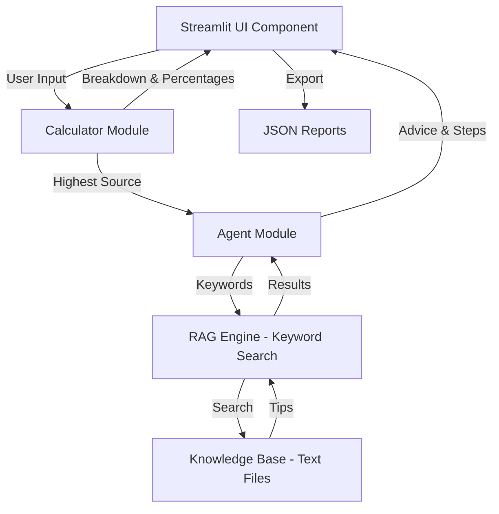

# Design Document: Carbon Footprint Reduction Agent

## Overview

The Carbon Footprint Reduction Agent is a Python-based web application built with Streamlit that provides users with comprehensive carbon footprint analysis and personalized sustainability recommendations. The system architecture follows a modular design with clear separation between calculation logic, AI advice generation, knowledge retrieval, and user interface components.

The application processes user consumption data across five categories (electricity, transport, food, waste, water), applies scientifically-backed emission factors to calculate CO2 emissions, performs statistical analysis to identify the highest contributor, and leverages a keyword-based RAG (Retrieval-Augmented Generation) system to provide contextual advice from a local knowledge base. The system emphasizes Windows compatibility by using lightweight keyword matching instead of heavy ML dependencies.

## Architecture

### High-Level Architecture



### Component Interaction Flow

1. **Input Phase**: User enters consumption data through Streamlit UI
2. **Calculation Phase**: Calculator module processes inputs and computes emissions
3. **Analysis Phase**: Calculator identifies highest emission source and percentages
4. **Retrieval Phase**: Agent module queries knowledge base via keyword matching
5. **Generation Phase**: Agent generates personalized advice and actionable steps
6. **Visualization Phase**: UI renders metrics, charts, and recommendations
7. **Export Phase**: User can save or download JSON reports

### Design Principles

- **Modularity**: Clear separation between calculation, advice generation, and UI
- **Lightweight**: Keyword-based retrieval instead of heavy ML models for Windows compatibility
- **Extensibility**: Easy to add new emission categories or knowledge base documents
- **User-Centric**: Immediate visual feedback, animations, and actionable recommendations

## Components and Interfaces

### 1. Calculator Module (`src/calculator.py`)

**Purpose**: Performs all CO2 emission calculations using predefined emission factors.

**Key Functions**:

```python
def calculate_electricity_co2(kwh: float) -> float:
    """
    Calculates CO2 emissions from electricity consumption.
    
    Args:
        kwh: Electricity consumption in kilowatt-hours
        
    Returns:
        CO2 emissions in kilograms
    """
    return kwh * EMISSION_FACTORS["electricity_kwh"]

def calculate_transport_co2(
    petrol: float = 0,
    diesel: float = 0,
    bus_km: float = 0,
    train_km: float = 0,
    flight_km: float = 0
) -> float:
    """
    Calculates total CO2 emissions from all transport sources.
    
    Args:
        petrol: Petrol consumption in liters
        diesel: Diesel consumption in liters
        bus_km: Bus travel in kilometers
        train_km: Train travel in kilometers
        flight_km: Flight travel in kilometers
        
    Returns:
        Total transport CO2 emissions in kilograms
    """
    # Sum all transport contributions

def calculate_food_co2(diet_type: str, days: int = 30) -> float:
    """
    Calculates CO2 emissions from food consumption based on diet type.
    
    Args:
        diet_type: "veg" or "nonveg"
        days: Number of days (default 30 for monthly)
        
    Returns:
        Food-related CO2 emissions in kilograms
    """
    # Apply daily emission factor based on diet

def calculate_waste_co2(plastic_kg: float = 0, ewaste_kg: float = 0) -> float:
    """
    Calculates CO2 emissions from waste generation.
    
    Args:
        plastic_kg: Plastic waste in kilograms
        ewaste_kg: Electronic waste in kilograms
        
    Returns:
        Waste-related CO2 emissions in kilograms
    """
    # Sum plastic and e-waste contributions

def calculate_water_co2(water_m3: float = 0) -> float:
    """
    Calculates CO2 emissions from water consumption.
    
    Args:
        water_m3: Water consumption in cubic meters
        
    Returns:
        Water-related CO2 emissions in kilograms
    """
    # Apply water emission factor

def calculate_total_co2(user_inputs: dict) -> tuple[dict, dict, str]:
    """
    Calculates total CO2 emissions with breakdown and analysis.
    
    Args:
        user_inputs: Dictionary containing all consumption data
        
    Returns:
        Tuple of (breakdown, percentages, highest_source)
        - breakdown: Dict with emissions per category and totals
        - percentages: Dict with percentage contribution per category
        - highest_source: String name of category with highest percentage
    """
    # Calculate all categories
    # Compute monthly and yearly totals
    # Calculate percentages
    # Identify highest source
```

**Emission Factors** (India-based):
- Electricity: 0.82 kg CO2/kWh
- Petrol: 2.31 kg CO2/L
- Diesel: 2.68 kg CO2/L
- LPG: 2.98 kg CO2/kg
- CNG: 2.75 kg CO2/kg
- Bus: 0.05 kg CO2/km
- Train: 0.01 kg CO2/km
- Flight: 0.15 kg CO2/km
- Vegetarian diet: 2.0 kg CO2/day
- Non-vegetarian diet: 5.0 kg CO2/day
- Plastic: 6.0 kg CO2/kg
- E-waste: 20.0 kg CO2/kg
- Water: 0.34 kg CO2/m³

### 2. Agent Module (`src/agent.py`)

**Purpose**: Generates AI-driven advice, explanations, and actionable steps using keyword-based retrieval.

**Key Functions**:

```python
def simple_retrieve(keywords: list[str]) -> list[str]:
    """
    Retrieves relevant tips from knowledge base using keyword matching.
    
    Args:
        keywords: List of search terms (case-insensitive)
        
    Returns:
        List of up to 5 randomly selected matching tips
        
    Algorithm:
        1. Iterate through all .txt files in rag_docs/
        2. For each line, check if any keyword matches (case-insensitive)
        3. Add non-empty, non-duplicate lines to results
        4. Return random sample of up to 5 tips
    """
    # Find rag_docs path relative to module
    # Iterate through .txt files
    # Perform keyword matching
    # Return random sample

def generate_advice(
    breakdown: dict,
    percentages: dict,
    highest_source: str
) -> str:
    """
    Generates personalized sustainability advice based on highest emission source.
    
    Args:
        breakdown: Emission breakdown by category
        percentages: Percentage contribution by category
        highest_source: Category with highest emissions
        
    Returns:
        Formatted advice string with tips from knowledge base
        
    Algorithm:
        1. Map highest_source to relevant keywords
        2. Retrieve tips using simple_retrieve()
        3. Format tips as bullet points
        4. Include percentage contribution in response
    """
    # Map category to keywords
    # Retrieve tips
    # Format response

def explain_decision(
    breakdown: dict,
    percentages: dict,
    highest_source: str
) -> str:
    """
    Explains why the AI selected a particular category as the main problem.
    
    Args:
        breakdown: Emission breakdown by category
        percentages: Percentage contribution by category
        highest_source: Category with highest emissions
        
    Returns:
        Formatted explanation string
    """
    # Explain selection logic
    # List all compared categories
    # State decision criteria

def generate_actionable_steps(
    breakdown: dict,
    percentages: dict,
    highest_source: str
) -> str:
    """
    Generates time-bound actionable steps for the highest emission source.
    
    Args:
        breakdown: Emission breakdown by category
        percentages: Percentage contribution by category
        highest_source: Category with highest emissions
        
    Returns:
        Formatted string with immediate, weekly, and long-term actions
        
    Algorithm:
        1. Look up predefined actions for highest_source
        2. Return three-tier action plan (immediate, weekly, long-term)
        3. Format as bullet points
    """
    # Map category to action plan
    # Format steps
```

**Keyword Mapping**:
- Electricity → ["electricity", "energy", "power", "led", "solar", "appliance"]
- Transport → ["transport", "vehicle", "car", "fuel", "petrol", "diesel", "commute"]
- Food → ["food", "diet", "meat", "veg", "vegetarian", "eat"]
- Waste → ["waste", "plastic", "recycle", "compost", "landfill"]
- Water → ["water", "rainwater", "shower", "tap"]

### 3. RAG Engine Module (`src/rag_engine.py`)

**Purpose**: Provides vector-based RAG functionality using LangChain and ChromaDB (alternative to keyword-based approach).

**Note**: This module is available but not actively used in the current implementation due to Windows compatibility concerns. The system uses the lightweight keyword-based approach in `agent.py` instead.

**Key Functions**:

```python
def load_rag() -> Chroma:
    """
    Loads documents from rag_docs/ and creates a vector database.
    
    Returns:
        ChromaDB vector store with embedded documents
        
    Algorithm:
        1. Load all text files from rag_docs/
        2. Split documents into chunks (500 chars, 50 overlap)
        3. Create embeddings using HuggingFace model
        4. Store in ChromaDB with persistence
    """
    # Load documents
    # Split into chunks
    # Create embeddings
    # Persist to disk
```

### 4. UI Component (`app/app.py`)

**Purpose**: Provides the Streamlit-based user interface with input forms, visualizations, and export functionality.

**Key Sections**:

1. **Page Configuration**: Sets page title, icon, layout, and custom CSS
2. **Custom Styling**: Defines animations, hover effects, gradients, and responsive design
3. **Input Collection**: Three-column layout for energy, transport, and lifestyle inputs
4. **Calculation Trigger**: Centered button with loading spinner
5. **Results Display**: Metrics, charts, advice, action plans, and export options

**UI Layout Structure**:

```
Header (Gradient Title + Subtitle)
---
Input Section (3 columns)
  - Energy (Electricity, Water)
  - Transport (Petrol, Diesel, Public Transport)
  - Lifestyle (Diet, Waste)
---
Calculate Button (Centered)
---
Results Section (if calculated)
  - Emissions Summary (3 metrics)
  - Visualization Row
    - Bar Chart (Breakdown)
    - Primary Offender Card (Quick Fix + Explanation)
  - AI Reduction Strategy
  - Action Plan
  - Sustainability Status + Export Options
```

**Session State Management**:
- `breakdown`: Stores emission breakdown dictionary
- `percentages`: Stores percentage contributions
- `highest`: Stores highest emission source
- `results_ready`: Boolean flag indicating calculation completion

**Styling Features**:
- Fade-in animations on page load
- Hover effects on input fields (transform, shadow)
- Metric card hover effects (scale, shadow, border)
- Gradient backgrounds on buttons
- Responsive column layouts
- Dark mode support

### 5. Knowledge Base (`rag_docs/`)

**Purpose**: Stores domain knowledge for sustainability advice generation.

**Files**:
- `carbon_reduction.txt`: Tips for reducing emissions across all categories
- `emission_factors.txt`: Reference data on CO2 emission factors
- `sustainability_standards.txt`: Standards and guidelines
- `climate_policy.txt`: Policy information

**Format**: Plain text files with one tip/fact per line for easy keyword matching.

## Data Models

### User Input Model

```python
user_inputs = {
    "electricity_kwh": float,      # Electricity consumption in kWh
    "petrol_liters": float,        # Petrol consumption in liters
    "diesel_liters": float,        # Diesel consumption in liters
    "bus_km": float,               # Bus travel in kilometers
    "train_km": float,             # Train travel in kilometers
    "flight_km": float,            # Flight travel in kilometers
    "diet": str,                   # "veg" or "nonveg"
    "plastic_kg": float,           # Plastic waste in kilograms
    "ewaste_kg": float,            # E-waste in kilograms
    "water_m3": float,             # Water consumption in cubic meters
    "days": int                    # Number of days (default 30)
}
```

### Breakdown Model

```python
breakdown = {
    "electricity": float,          # CO2 from electricity (kg)
    "transport": float,            # CO2 from transport (kg)
    "food": float,                 # CO2 from food (kg)
    "waste": float,                # CO2 from waste (kg)
    "water": float,                # CO2 from water (kg)
    "monthly_total": float,        # Total monthly CO2 (kg)
    "yearly_total": float          # Projected yearly CO2 (kg)
}
```

### Percentages Model

```python
percentages = {
    "electricity": float,          # Percentage contribution (0-100)
    "transport": float,            # Percentage contribution (0-100)
    "food": float,                 # Percentage contribution (0-100)
    "waste": float,                # Percentage contribution (0-100)
    "water": float                 # Percentage contribution (0-100)
}
```

### Report Export Model

```python
report = {
    "breakdown": dict,             # Breakdown model
    "percentages": dict,           # Percentages model
    "highest_source": str,         # Category name
    "timestamp": str               # ISO format timestamp
}
```

### Chart Data Model

```python
chart_data = pd.DataFrame({
    "Category": ["Electricity", "Transport", "Food", "Waste", "Water"],
    "Emissions (kg)": [float, float, float, float, float]
})
```


## Correctness Properties

A property is a characteristic or behavior that should hold true across all valid executions of a system—essentially, a formal statement about what the system should do. Properties serve as the bridge between human-readable specifications and machine-verifiable correctness guarantees.

### Property 1: Category Emission Calculations

*For any* valid consumption value in a category (electricity, transport, food, waste, or water), the calculated CO2 emission should equal the consumption value multiplied by the appropriate emission factor(s) for that category.

**Validates: Requirements 1.1, 1.2, 1.3, 1.4, 1.5**

### Property 2: Monthly and Yearly Total Consistency

*For any* set of user inputs, the monthly total CO2 should equal the sum of all five category emissions (electricity + transport + food + waste + water), and the yearly total should equal the monthly total multiplied by 12.

**Validates: Requirements 1.6, 1.7**

### Property 3: Value Rounding Precision

*For any* calculated emission value or percentage in the breakdown, all numeric values should be rounded to exactly 2 decimal places.

**Validates: Requirements 1.8, 2.4**

### Property 4: Percentage Calculation Accuracy

*For any* non-zero monthly total, each category's percentage should equal (category_emission / monthly_total) * 100, rounded to 2 decimal places, and all percentages should sum to approximately 100% (within rounding tolerance).

**Validates: Requirements 2.1**

### Property 5: Highest Source Identification

*For any* set of calculated percentages, the identified highest emission source should be the category with the maximum percentage value.

**Validates: Requirements 2.2**

### Property 6: Keyword-Based Retrieval Correctness

*For any* list of search keywords, all retrieved tips from the knowledge base should contain at least one of the keywords (case-insensitive), have no duplicates, contain no empty strings, and the result size should not exceed 5 tips.

**Validates: Requirements 3.2, 3.3, 10.1, 10.2, 10.3, 10.5**

### Property 7: Advice Content Completeness

*For any* highest emission source, the generated advice string should contain the source name and its percentage contribution value.

**Validates: Requirements 3.5**

### Property 8: Explanation Content Completeness

*For any* emission breakdown, the generated explanation should contain the CO2 amount for the highest source, its percentage, and mention all five category names (electricity, transport, food, waste, water).

**Validates: Requirements 4.1, 4.2**

### Property 9: Action Plan Structure

*For any* highest emission source, the generated actionable steps should contain all three time horizons: "Immediately", "This Week", and "Long Term".

**Validates: Requirements 5.1**

### Property 10: Chart Data Structure

*For any* emission breakdown, the generated chart data should be a DataFrame with exactly 5 rows (one per category), contain columns "Category" and "Emissions (kg)", and the emission values should match the breakdown values.

**Validates: Requirements 6.3, 6.4**

### Property 11: Potential Savings Calculation

*For any* emission breakdown with a highest source, the calculated potential savings should equal yearly_total * (highest_percentage / 100) * 0.3, rounded to 2 decimal places.

**Validates: Requirements 8.4**

### Property 12: Report Export Structure

*For any* emission calculation, the exported JSON report should contain exactly four keys: "breakdown", "percentages", "highest_source", and "timestamp", with breakdown and percentages being dictionaries and highest_source being a string.

**Validates: Requirements 9.1, 9.4**

### Property 13: Directory Creation Idempotence

*For any* save operation, if the outputs/user_reports directory does not exist before the save, it should exist after the save operation completes.

**Validates: Requirements 9.2**

### Property 14: Filename Format Compliance

*For any* generated report filename (save or download), the filename should match the expected format pattern: "report_YYYYMMDD_HHMMSS.json" for system saves or "carbon_report_YYYYMMDD.json" for downloads, where YYYY, MM, DD, HH, MM, SS are valid date/time components.

**Validates: Requirements 9.3, 9.5**

### Property 15: Case-Insensitive Keyword Matching

*For any* keyword and any line of text from the knowledge base, if the keyword matches the line in lowercase, it should also match regardless of the original case of either the keyword or the line.

**Validates: Requirements 10.2**

## Error Handling

### Calculator Module Error Handling

1. **Invalid Input Types**: All calculation functions expect numeric types (float/int). Type validation should occur at the UI layer before passing to calculator functions.

2. **Negative Values**: The calculator does not explicitly reject negative values, as the UI layer uses `min_value=0.0` constraints on all numeric inputs.

3. **Division by Zero**: When monthly_total is zero, the percentage calculation explicitly checks and sets all percentages to 0 to avoid division by zero errors.

4. **Invalid Diet Type**: The `calculate_food_co2` function uses case-insensitive comparison and defaults to vegetarian calculation if the diet type doesn't match "nonveg".

### Agent Module Error Handling

1. **Missing Knowledge Base**: If the rag_docs directory does not exist, `simple_retrieve` returns a list with a single error message: "Knowledge base directory not found locally."

2. **File Read Errors**: When reading knowledge base files, exceptions are caught, printed to console, and processing continues with other files.

3. **Empty Retrieval Results**: If no tips are found matching the keywords, `generate_advice` provides a default recommendation: "Consider conducting a detailed energy audit for more specific insights."

4. **Invalid Category**: If the highest_source doesn't match any known category in the keyword map or action map, the functions use the category name itself as a keyword or provide a generic action.

### UI Component Error Handling

1. **Save Failures**: If saving a report to the file system fails, the exception is caught and displayed to the user via `st.error(str(e))`.

2. **Session State**: The UI checks for `st.session_state.get('results_ready')` before displaying results, preventing errors when no calculation has been performed.

3. **OpenMP Compatibility**: The application sets `os.environ["KMP_DUPLICATE_LIB_OK"] = "TRUE"` to handle OpenMP library conflicts on Windows.

### Graceful Degradation

The system is designed to continue operating even when:
- Knowledge base files are missing or corrupted (uses default advice)
- Individual files cannot be read (skips and continues)
- No matching tips are found (provides generic recommendations)
- File system operations fail (displays error but doesn't crash)

## Testing Strategy

### Dual Testing Approach

The Carbon Footprint Reduction Agent requires both unit testing and property-based testing for comprehensive validation:

**Unit Tests**: Verify specific examples, edge cases, and error conditions
- Specific emission calculations with known inputs/outputs
- Edge cases (zero emissions, missing knowledge base, file errors)
- UI component rendering with specific data
- Error handling scenarios

**Property Tests**: Verify universal properties across all inputs
- Mathematical relationships hold for all valid inputs
- Data structure invariants are maintained
- String formatting contains required elements
- Rounding and precision rules are consistent

### Property-Based Testing Configuration

**Library Selection**: Use **Hypothesis** for Python property-based testing

**Test Configuration**:
- Minimum 100 iterations per property test
- Each property test must reference its design document property
- Tag format: `# Feature: carbon-footprint-agent, Property {number}: {property_text}`

**Example Property Test Structure**:

```python
from hypothesis import given, strategies as st
import pytest

# Feature: carbon-footprint-agent, Property 2: Monthly and Yearly Total Consistency
@given(
    electricity=st.floats(min_value=0, max_value=10000),
    petrol=st.floats(min_value=0, max_value=1000),
    # ... other inputs
)
def test_monthly_yearly_consistency(electricity, petrol, ...):
    """
    For any set of user inputs, the monthly total CO2 should equal 
    the sum of all five category emissions, and the yearly total 
    should equal the monthly total multiplied by 12.
    """
    user_inputs = {
        "electricity_kwh": electricity,
        "petrol_liters": petrol,
        # ... other inputs
    }
    
    breakdown, percentages, highest = calculate_total_co2(user_inputs)
    
    # Verify monthly total equals sum of categories
    expected_monthly = (
        breakdown["electricity"] + 
        breakdown["transport"] + 
        breakdown["food"] + 
        breakdown["waste"] + 
        breakdown["water"]
    )
    assert abs(breakdown["monthly_total"] - expected_monthly) < 0.01
    
    # Verify yearly equals monthly * 12
    assert abs(breakdown["yearly_total"] - breakdown["monthly_total"] * 12) < 0.01
```

### Unit Testing Strategy

**Calculator Module Tests**:
- Test each emission factor calculation with known values
- Test edge case: zero emissions across all categories
- Test edge case: very large consumption values
- Test diet type case-insensitivity
- Test percentage calculation with zero total

**Agent Module Tests**:
- Test keyword mapping for all five categories
- Test retrieval with missing knowledge base directory
- Test retrieval with empty results
- Test file read error handling
- Test advice formatting contains required elements
- Test action plan contains all time horizons

**UI Component Tests** (if using Streamlit testing framework):
- Test session state management
- Test chart data generation
- Test report export structure
- Test filename generation
- Test sustainability status thresholds

### Integration Testing

**End-to-End Flow Tests**:
1. Input → Calculation → Display: Verify complete flow with sample data
2. Calculation → Advice → Actions: Verify AI pipeline produces valid output
3. Calculation → Export → Reload: Verify report round-trip consistency

**Knowledge Base Integration**:
- Test with actual knowledge base files
- Test with modified/corrupted files
- Test with missing files

### Test Data Strategy

**Property Test Generators**:
- Consumption values: 0 to realistic maximums (electricity: 0-10000 kWh, etc.)
- Diet types: ["veg", "nonveg", "Veg", "NonVeg", "VEG", "NONVEG"]
- Days: 1 to 365
- Keywords: Sample from actual knowledge base content

**Unit Test Fixtures**:
- Zero emissions scenario
- Balanced emissions scenario (all categories equal)
- Single dominant category scenarios (one category >> others)
- Edge values (very small, very large)

### Coverage Goals

- **Line Coverage**: Minimum 90% for calculator and agent modules
- **Branch Coverage**: Minimum 85% for all conditional logic
- **Property Coverage**: 100% of design properties implemented as tests
- **Edge Case Coverage**: All identified edge cases have explicit tests

### Continuous Testing

- Run unit tests on every commit
- Run property tests (with reduced iterations) on every commit
- Run full property test suite (100+ iterations) nightly
- Monitor test execution time and optimize slow tests
- Track property test failure rates to identify flaky tests
